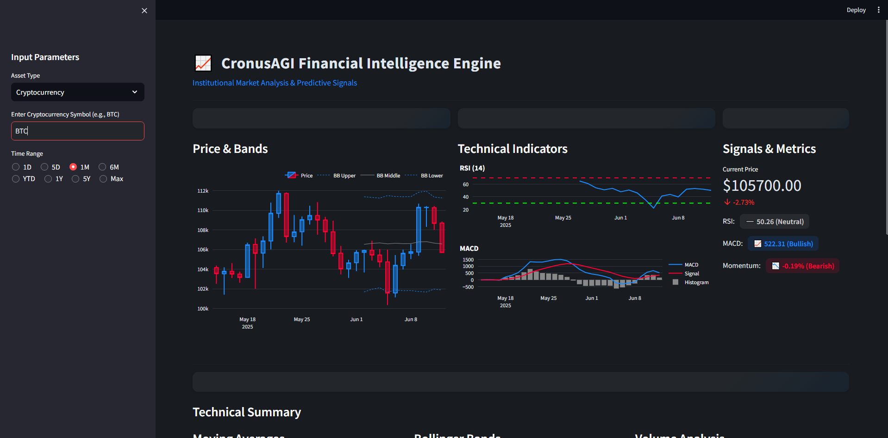

# CronusAGI Financial Intelligence Engine

A modern, institutional-grade dashboard for real-time market analysis, technical signals, and sentiment detection. Built for the CronusAGI platform, this MVP simulates a professional financial intelligence portal for stocks and cryptocurrencies.

---

## 🚀 Features

- **User Input**: Enter stock tickers or crypto symbols
- **Time Range Selector**: Choose from 1D, 5D, 1M, 6M, YTD, 1Y, 5Y, Max (horizontal radio, institutional style)
- **Market Data**: Real-time price charts with candlesticks and Bollinger Bands
- **Technical Indicators**: SMA20, SMA50, RSI, MACD, Momentum, Volume MA, Bollinger Bands
- **Signal Dashboard**: Bullish/Bearish/Neutral signals with icons and color badges
- **News & Sentiment**: (Requires paid FMP API key) Latest news headlines and sentiment analysis
- **Dark Mode**: Gunmetal, grayscale, cobalt blue, and subtle neon highlights
- **Grid Layout**: Responsive, card-based, and visually balanced
- **Professional UI**: Modern, minimal, and institutional feel

---

## 🛠️ Tech Stack
- **Python 3.8+**
- **Streamlit** (UI framework)
- **Plotly** (interactive charts)
- **Pandas, NumPy** (data analysis)
- **Polygon.io API** (market data)
- **FMP API** (news, paid key required)
- **TextBlob** (sentiment analysis)
- **dotenv** (API key management)

---

## ⚡ Setup Instructions

1. **Clone the repository**
   ```bash
   git clone https://github.com/nshinakazimi/CronusAGI-Financial-Intelligence-Engine-MVP-Version.git
   
   ```

2. **Create a virtual environment**
   ```bash
   python -m venv venv
   # On Windows:
   venv\Scripts\activate
   # On Mac/Linux:
   source venv/bin/activate
   ```

3. **Install dependencies**
   ```bash
   pip install -r requirements.txt
   ```

4. **Set up your API keys**
   - Create a `.env` file in the project root:
     ```
     POLYGON_API_KEY=
     ARYA_API_KEY=
     FMP_API_KEY=
     ```
   - [Get a free Polygon API key](https://polygon.io/)
   - [Get a free ARYA API key](https://exa.ai/)
   - [Get an FMP API key](https://financialmodelingprep.com/developer/docs/pricing/)

5. **Run the app**
   ```bash
   streamlit run app.py
   ```

---

## 🖥️ Usage

- Enter a stock or crypto symbol (e.g., `AAPL`, `BTC`)
- Select a time range (1D, 5D, 1M, etc.)
- View price charts, technical indicators, and signals
- If you have a paid FMP API key, view news and sentiment analysis

---

## 🎨 Customization
- **Colors & Branding**: Edit the CSS in `app.py` for your own palette or logo
- **Indicators**: Add/remove technical indicators in `services/market_data.py`
- **News/Sentiment**: Swap in another news API if desired

---

## 🧩 Project Structure

```
├── app.py                # Main Streamlit app
├── services/
│   ├── market_data.py    # Market data & technicals
│   └── sentiment_analysis.py # Sentiment analysis
├── requirements.txt      # Python dependencies
├── .env                  # Your API keys (not committed)
└── README.md             # This file
```

---

## 🛟 Troubleshooting
- **No data for symbol**: Check spelling, or try a different ticker/crypto
- **News not showing**: You need a paid FMP API key for news/sentiment
- **API errors**: Check your `.env` file and API key limits
- **Charts not loading**: Try a different time range or symbol

---

## 📸 Screenshots


---

CronusAGI Financial Intelligence Engine | MVP Version 